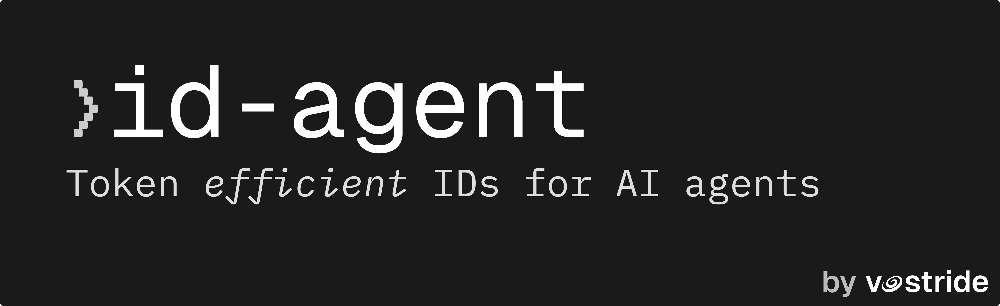
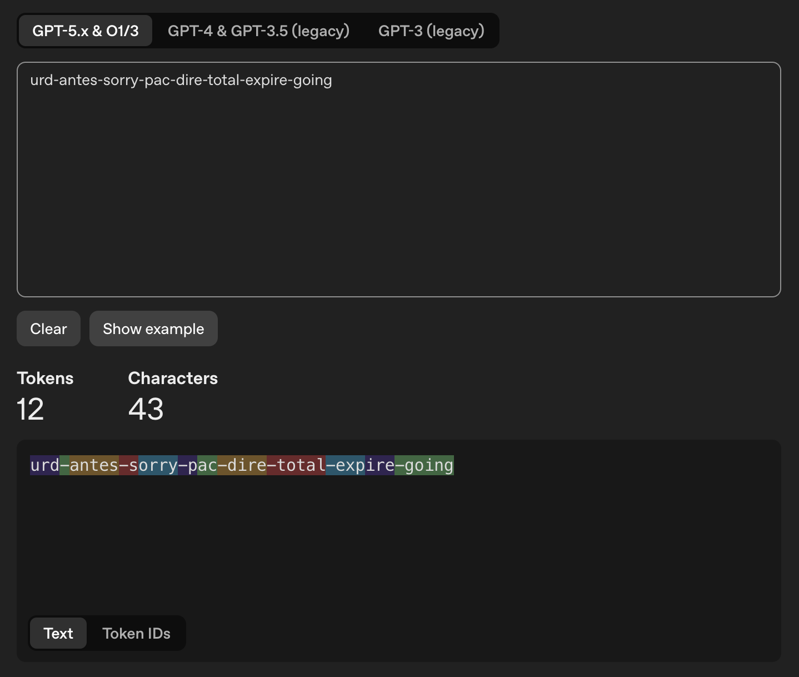
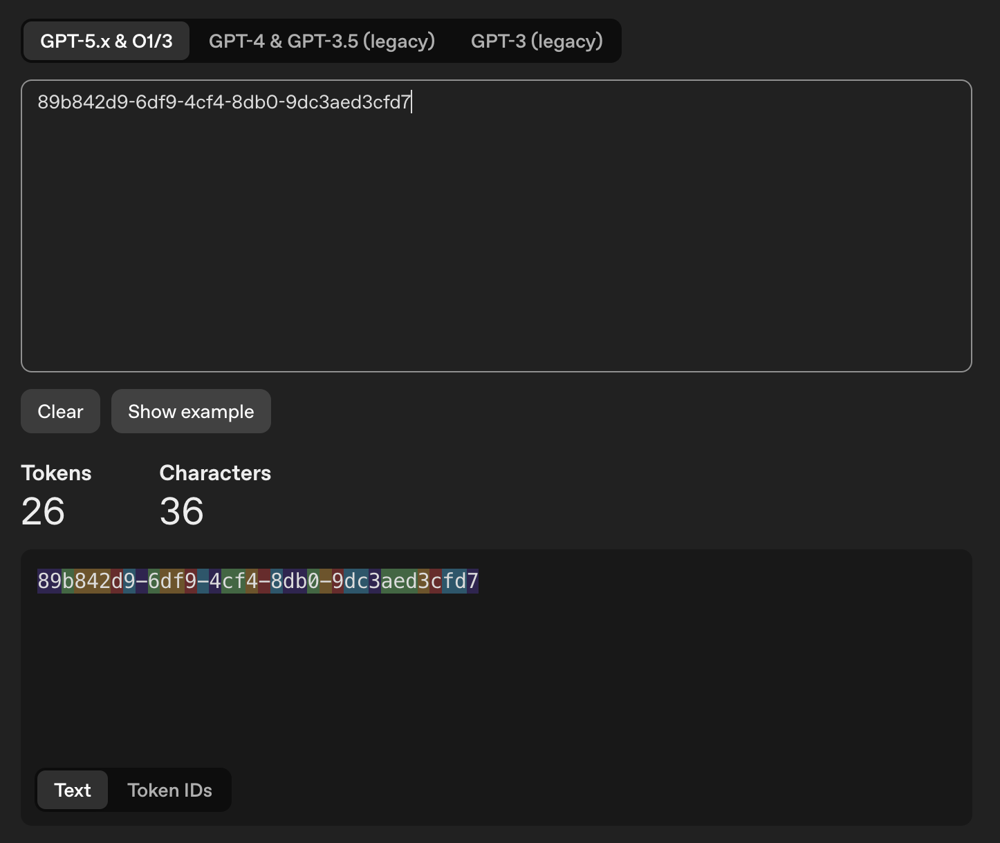

<p align="center">
  
</p>


<p align="center">
  <a href="https://www.npmjs.com/package/id-agent"></a>
  <a href="https://github.com/vostride/id-agent/actions/workflows/ci.yml"></a>
  <a href="https://bundlephobia.com/package/id-agent"></a>
</p>

# id-agent
> Token efficient IDs for AI agents 

Where UUIDs cost ~23 tokens and get hallucinated by LLMs, id-agent produces memorable word-based IDs at ~14 tokens with equivalent collision resistance. The first ID library built for the context window, not the database.

- **Human-readable** -- word-based IDs that humans and LLMs can actually remember
- **Token-efficient** -- every word in the wordlist is exactly 1 BPE token on o200k_base
- **Collision-safe** -- configurable entropy from ~12 to ~192 bits
- **Validated inputs** -- zod-powered schema validation on all public APIs

## Token Cost Comparison

| Format | Example | Tokens (o200k_base) | Collision Resistance |
|--------|---------|---------------------|----------------------|
| UUID v4 | `89b842d9-6df9-4cf4-8db0-9dc3aed3cfd7` | ~23 | 122 bits |
| id-agent (default, 8 words) | `urd-antes-sorry-pac-dire-total-expire-going` | ~14 | ~96 bits |
| id-agent (5 words) | `frame-beer-bell-tog-hoot` | ~8 | ~60 bits |

<table align="center">
  <tr>
    <td align="center"><br/><strong>id-agent</strong> — 8 words, 43 chars, <strong>12 tokens</strong></td>
    <td align="center"><br/><strong>UUID v4</strong> — 36 chars, <strong>26 tokens</strong></td>
  </tr>
</table>

## Install

```bash
npm install id-agent
```

```bash
pnpm add id-agent
```

## Quick Start

```typescript
import { idAgent } from 'id-agent'

// Generate a random ID (8 words, ~96 bits entropy)
const id = idAgent()
// => "urd-antes-sorry-pac-dire-total-expire-going"

// With a type prefix
const taskId = idAgent({ prefix: 'task' })
// => "task_slide-exact-cede-bury-linge-ease-bean-impact"

// Fewer words for short-lived IDs
const short = idAgent({ words: 3 })
// => "front-reject-tho"
```

## API Reference

### `idAgent(opts?)`

Generate a random, human-readable ID.

```typescript
import { idAgent } from 'id-agent'

idAgent()                          // 8 words, ~96 bits
idAgent({ words: 5 })             // 5 words, ~60 bits
idAgent({ prefix: 'user' })       // "user_cloud-train-scope-frame-match-level-paint-field"
```

**Options:**

| Option | Type | Default | Description |
|--------|------|---------|-------------|
| `prefix` | `string` | `undefined` | Type prefix (lowercase alphanumeric only) |
| `words` | `number` | `8` | Number of words (1-16). Controls entropy: words * 12 bits |

Invalid options throw a `ZodError` with a descriptive message.

### `idAgent.from(input, opts?)`

Generate a deterministic ID from a string input using HMAC-SHA256. Same input always produces the same ID.

```typescript
const id = await idAgent.from('user@example.com')
// Always returns the same ID for the same input

const namespaced = await idAgent.from('user@example.com', {
  namespace: 'my-app',
  prefix: 'user',
  words: 5,
})
```

**Options:**

| Option | Type | Default | Description |
|--------|------|---------|-------------|
| `prefix` | `string` | `undefined` | Type prefix (lowercase alphanumeric only) |
| `words` | `number` | `8` | Number of words (1-16) |
| `namespace` | `string` | `'id-agent'` | HMAC key for domain separation |

### `parse(id)`

Parse any id-agent ID into its components. Supports both hyphen-separated and underscore-separated words. Returns `null` for unrecognized formats.

```typescript
import { parse } from 'id-agent'

parse('task_storm-delta-stone')
// => { prefix: 'task', words: ['storm', 'delta', 'stone'], wordCount: 3, bits: 36, raw: 'task_storm-delta-stone', format: 'readable' }

parse('task_storm_delta_stone')
// => { prefix: 'task', words: ['storm', 'delta', 'stone'], wordCount: 3, bits: 36, raw: 'task_storm_delta_stone', format: 'readable' }
```

### `validate(id)`

Check if a string is a valid id-agent ID. Validates that all words exist in the WORDLIST.

```typescript
import { validate } from 'id-agent'

validate('storm-delta-stone')
// => { valid: true, prefix: undefined, wordCount: 3 }

validate('task_jump-notaword')
// => { valid: false, reason: 'unknown words: notaword' }

validate('INVALID')
// => { valid: false, reason: 'contains uppercase characters' }
```

### `createAliasMap(opts)`

Create a bidirectional alias map for token reduction in LLM contexts. Maps long IDs to short word-based aliases with full replace/restore support.

```typescript
import { createAliasMap } from 'id-agent'

const aliases = createAliasMap({ words: 3 })
aliases.set('8cdda07b-85d2-459c-8a2a-83c8f9245dbe')
// => "storm-delta-stone" (3 random words from WORDLIST)

aliases.get('storm-delta-stone')
// => "8cdda07b-85d2-459c-8a2a-83c8f9245dbe"

// Replace all UUIDs in text before sending to LLM
const text = 'Process 8cdda07b-85d2-459c-8a2a-83c8f9245dbe then 6ba7b810-9dad-11d1-80b4-00c04fd430c8'
const shortened = aliases.replace(text, {
  pattern: /[0-9a-f]{8}-[0-9a-f]{4}-[0-9a-f]{4}-[0-9a-f]{4}-[0-9a-f]{12}/gi
})
// => "Process storm-delta-stone then cloud-train-scope"

// Restore originals in LLM output
const restored = aliases.restore(shortened)
// => original text
```

**Options:**

| Option | Type | Required | Description |
|--------|------|----------|-------------|
| `words` | `number` | Yes | Number of words per alias (1-16) |

**`entries()`** returns `[original, alias]` pairs (not `[alias, original]`). Use `get(alias)` to look up the original from an alias.

### `detectDuplicates(opts)`

Scan text for duplicate IDs using a regex pattern. Pure function -- no filesystem access.

```typescript
import { detectDuplicates } from 'id-agent'

const dupes = detectDuplicates({
  pattern: /[a-z]+(?:-[a-z]+)+/,
  text: 'Found storm-delta-stone in file A and storm-delta-stone in file B',
})
// => [{ id: 'storm-delta-stone', count: 2 }]

// Also accepts an array of strings
const dupes2 = detectDuplicates({
  pattern: /task_[a-z]+(?:-[a-z]+)+/,
  text: ['const x = "task_red-fox-run"', 'const y = "task_red-fox-run"'],
})
```

**Options:**

| Option | Type | Description |
|--------|------|-------------|
| `pattern` | `RegExp` | Regex to match IDs in text |
| `text` | `string \| string[]` | Text to scan for duplicates |

### `WORDLIST`

Direct access to the curated 4096-word list. Every word is exactly 1 BPE token on o200k_base. The array is frozen (immutable).

```typescript
import { WORDLIST } from 'id-agent'

WORDLIST.length          // => 4096
Object.isFrozen(WORDLIST) // => true
```

## The Math

### Entropy

Each word is drawn uniformly from a curated **4096-word list** (2^12). Every position in the ID is an independent random selection:

```
Entropy per word = log2(4096) = 12 bits
Total entropy    = words * 12 bits
ID space         = 4096^words = 2^(words * 12)
```

This holds regardless of individual word length -- a 3-character word and a 6-character word both contribute exactly 12 bits because the attacker must guess from the same 4096-word pool.

### Collision Probability (Birthday Paradox)

The probability of at least one collision among `n` randomly generated IDs:

```
P(collision) ≈ n^2 / (2 * 2^b)

where b = total bits of entropy
```

This is the birthday paradox approximation, valid when P is small (P < 0.01).

| Words | Bits | ID Space | P @ 1K | P @ 10K | P @ 100K | P @ 1M | P @ 1B | 50% collision at |
|-------|------|----------|--------|---------|----------|--------|--------|------------------|
| 3 | 36 | 6.9 * 10^10 | 7.3 * 10^-6 | 7.3 * 10^-4 | 7.3 * 10^-2 | ~1 | ~1 | ~309K items |
| 4 | 48 | 2.8 * 10^14 | 1.8 * 10^-9 | 1.8 * 10^-7 | 1.8 * 10^-5 | 1.8 * 10^-3 | ~1 | ~20M items |
| 5 | 60 | 1.2 * 10^18 | 4.3 * 10^-13 | 4.3 * 10^-11 | 4.3 * 10^-9 | 4.3 * 10^-7 | 0.43 | ~1.3B items |
| **8** | **96** | **7.9 * 10^28** | **6.3 * 10^-24** | **6.3 * 10^-22** | **6.3 * 10^-20** | **6.3 * 10^-18** | **6.3 * 10^-12** | **~331T items** |
| 10 | 120 | 1.3 * 10^36 | 3.8 * 10^-31 | 3.8 * 10^-29 | 3.8 * 10^-27 | 3.8 * 10^-25 | 3.8 * 10^-19 | ~1.4 * 10^18 items |
| *UUID v4* | *122* | *5.3 * 10^36* | *9.4 * 10^-32* | *9.4 * 10^-30* | *9.4 * 10^-28* | *9.4 * 10^-26* | *9.4 * 10^-20* | *~2.7 * 10^18 items* |

**The default (8 words, 96 bits)** is safe for over 300 trillion items before reaching a 50% collision chance. For context, most applications will never generate more than a few million IDs.

### Worked Example

For the default 8-word ID at 1 million items:

```
b = 8 * 12 = 96 bits
n = 1,000,000

P ≈ (10^6)^2 / (2 * 2^96)
  = 10^12 / (2 * 7.92 * 10^28)
  = 10^12 / (1.58 * 10^29)
  = 6.3 * 10^-18
```

That's roughly **1 in 158 quadrillion** -- effectively zero.

### Token Cost (Measured)

All measurements on **o200k_base** (GPT-4o, GPT-4.1, o1, o3) using tiktoken. Token counts vary slightly per ID due to BPE merge behavior with hyphens -- values below are averages over 100 samples:

| Format | Avg Tokens | Entropy | Tokens Saved vs UUID | Savings |
|--------|-----------|---------|---------------------|---------|
| UUID v4 | **~23** | 122 bits | -- | -- |
| id-agent (3 words) | **~5** | 36 bits | ~18 | **78%** |
| id-agent (5 words) | **~8** | 60 bits | ~15 | **65%** |
| **id-agent (8 words, default)** | **~14** | **96 bits** | **~9** | **39%** |
| id-agent (10 words) | **~17** | 120 bits | ~6 | **26%** |

### Why Not Just Fewer Words?

The right word count depends on your scale. The default of 8 is deliberately conservative (global-safe). But if you're building something smaller:

| Scale | Recommended | Entropy | Why |
|-------|-------------|---------|-----|
| Dev/testing | `words: 3` | 36 bits | Fast, memorable, ~5 tokens. Collides at ~300K items. |
| Team tools | `words: 4` | 48 bits | Safe to ~20M items. Good for internal APIs. |
| Production SaaS | `words: 5` | 60 bits | Safe to ~1B items. 65% token savings vs UUID. |
| High-volume / distributed | `words: 8` (default) | 96 bits | Safe to ~300T items. The safe default. |
| UUID-equivalent | `words: 10` | 120 bits | Matches UUID v4 collision math. |

### Token Efficiency: Why Words Beat Hex

BPE tokenizers (used by all major LLMs) were trained on natural language. Short English words are single tokens by design. UUIDs are hex strings that split unpredictably:

```
"storm-delta-stone"  =>  4 tokens (3 words + separators)
"dc193952-186a-4645" =>  11 tokens (same 18 characters!)
```

id-agent's wordlist is curated so every word is exactly **1 BPE token** on o200k_base. The hyphens add ~1 token per 6 words due to BPE merge behavior. This is why word-based IDs are fundamentally more token-efficient than random hex/alphanumeric strings.

## How It Works

id-agent uses a curated wordlist of 4096 English words, each verified as a single BPE token on the o200k_base tokenizer (used by GPT-4o, GPT-4.1). Words are 3-6 characters, filtered for offensive terms and homophones.

Random IDs use `crypto.getRandomValues()` (CSPRNG). Deterministic IDs use HMAC-SHA256 via the Web Crypto API, mapping the hash to wordlist indices.

All public API inputs are validated with [zod](https://zod.dev) schemas. Invalid options throw with descriptive error messages.

## License

MIT
